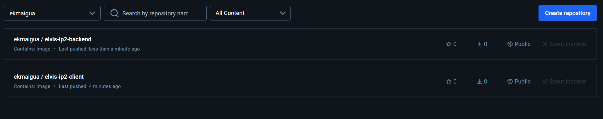
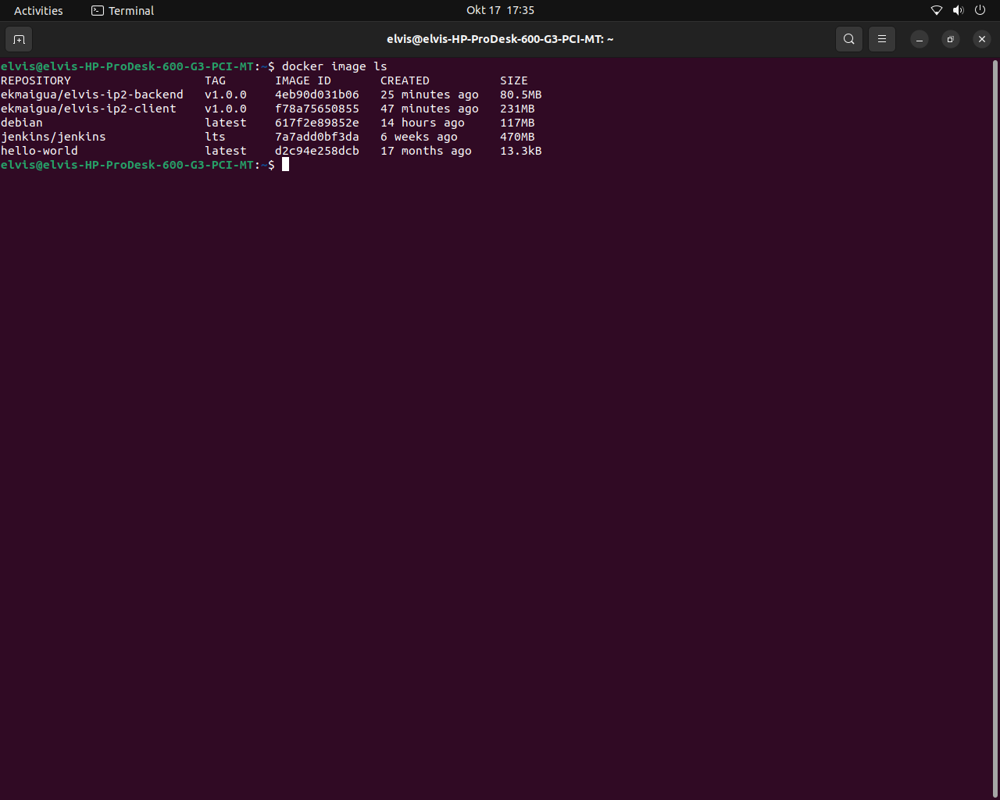

# Overview
This project involved the containerization and deployment of a full-stack yolo application using Docker.

# Requirements
Install the docker engine here:
- [Docker](https://docs.docker.com/engine/install/) 

## How to launch the application 

## How to run the app
Use vagrant up --provison command

## Explanation on what i did below

# 1. Creation of the Dockerfile and set the working directory

# 2. Minimal base image was Alpine Linux: Known for its small size, Alpine is a great choice for building lightweight Docker images.

# 3. Copy dependencies, and install dependencies

# 4. Copy the rest of the files and expose the app port

# Fixed the issues in the docker-compose.yaml files.

# Fixed the bridging issue

# Updating the docker username and containers names

# Running docker build -t to build the images on my local machine

# Running docker push to push it to docker hub

# Below are images for the docker hub and local machine 

###### ANSIBLE ASSIGNMENT IP 2 ####################

# Initializing a Vagrantfile and addition of the geerlingguy vagrant box. 

# Creation of the playbook.yml

# Updating the roles for backend-deployment

# Updating the roles for frontend-deploment

# Setting up Github processes on playbook.yml and nececssary setups to run my application

##### CONFIGURING TERRAFORM USING GCP ##################

# Branched the project and created the Stage two folder

# Created a prj0ect on GCP AND ADDED THE Compute Engine API

# Adding main.tf after exporting the json file with the key then configuring it ti create a small debian VM instance with Docker pre-installed.

# Terraform initialization and applicarion with GCP project to get public IP and adding it as a host for ansible

##### CONFIGURING OF GKE AND KUBERNETES ON IP4 ##################

# Creation and set up of the GKE cluster on google cloud using this script; gcloud container clusters create ip4-cluster --zone us-central1-a --num-nodes=2

# Configure kubectl for the cluster using this script: gcloud container clusters get-credentials ip4-cluster --zone us-central1-a --project ip2-terraform

# Creation of the front-end deployment.yaml file.

# Use StatefulSets for MongoDB to provide stable network IDs and persistent storage for each database pod. StatefulSets are preferred for stateful applications like databases where persistent storage and stable identity are crucial.
